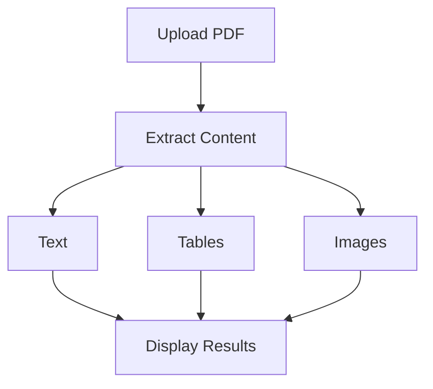

# PDF-Insight

A modern web application for extracting text, tables, and images from PDF documents.



## Features
- Text extraction
- Table detection and parsing
- Image extraction
- Dark mode UI
- Responsive design
- Animated interactions

## Tech Stack
| Component | Technology |
|-----------|------------|
| Backend | Flask |
| PDF Processing | PyPDF2, Tabula, PDFPlumber |
| Image Processing | PyMuPDF |
| Frontend | HTML, CSS, JavaScript |
| Animations | Animate.css |

## Installation

1. Clone the repository
```bash
git clone https://github.com/yourusername/PDF-Insight.git
cd PDF-Insight
```

2. Install dependencies
```bash
pip install -r requirements.txt
```

3. Install Java (required for Tabula)
Download from: https://adoptium.net/

## Usage

1. Start the server:
```bash
python app.py
```

2. Open http://localhost:5000 in your browser

## Project Structure
```
PDF-Insight/
├── app.py              # Main Flask application
├── templates/          # HTML templates
│   └── index.html     # Main UI template
├── uploads/           # Temporary PDF storage
├── requirements.txt   # Python dependencies
└── README.md         # Documentation
```

## Dependencies
- Flask==3.0.0
- PyPDF2==3.0.1
- tabula-py==2.9.0
- pdfplumber==0.10.3
- PyMuPDF==1.23.8
- Pillow==10.2.0
- jpype1==1.5.0

## License

This project is licensed under the [MIT License](LICENSE).  
© 2025 Siddharth


## Contributing
Pull requests are welcome. For major changes, please open an issue first to discuss what you would like to change.
